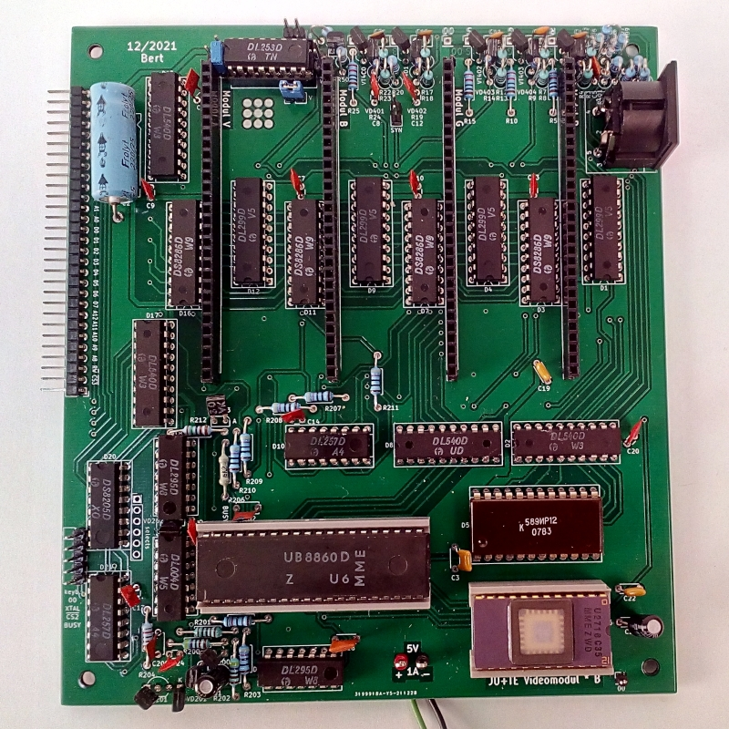
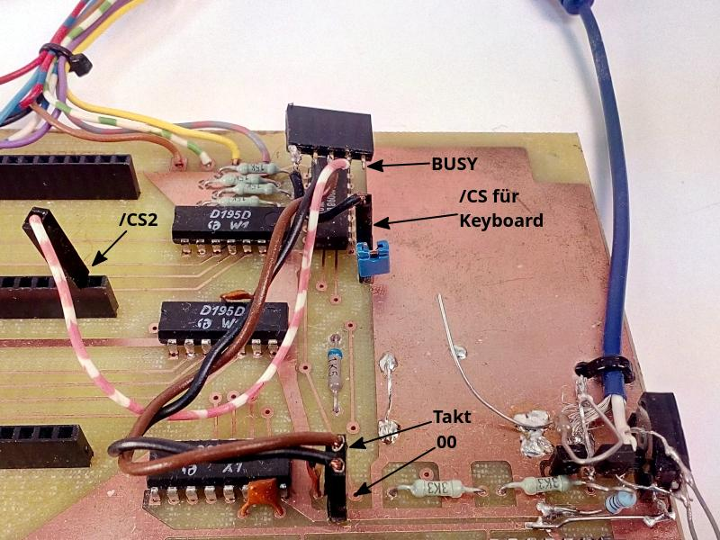
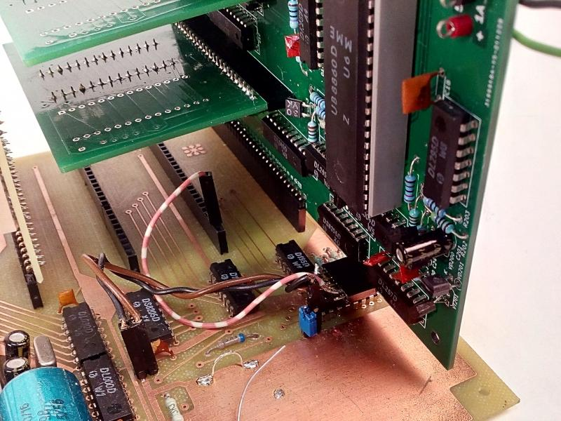

# JU+TE Videoerweiterung, 2021

Mit der Videoerweiterung läßt sich das Grundsystem zum 6k-System erweitern.

## Voraussetzungen
Folgende Voraussetzungen sind dafür zu erfüllen:
- im Steckplatz 1 (/CS0, /CS7) muß der EPROM mit dem 6k-System stecken
- im Steckplatz 1 müssen 8 kByte RAM bestückt sein
- im Steckplatz 4 wird die Videoerweiterung gesteckt
- ggf. muß eine angepasste Tastatur verwendet werden
- die Zusatzverbindungen für Takt, /CS2, /KEY und BUSY sind herzustellen
- es wird ein Bildschirm mit SCART-Eingang und ein entprechendes Adapterkabel benötigt

## Veränderungen gegenüber der Originalplatine
Die Version 2021 der Videoerweiterung enthält gegenüber dem Original von 1990 folgende Veränderungen:
- Videobuchse (DIN 5-polig) inklusive der nötigen Widerstände integriert;
  es passt das SCART-Adapterkabel vom Z9001
- Verbindungen zur Hauptplatine (Takt, /CS2, BUSY und /KEY) auf einer Steckleiste zusammengefasst
- BUSY-Signal zum Rand geführt
- Jumper für Umschaltsignal (high resolution) /HR ergänzt (Auswahl: low, high oder P3.4)
- am Videomultiplexer wurden Jumper für die Signale B und V ergänzt
- Jumper W hinzugefügt, um den Widerstandswert von R36 anpassen zu können (6,8 kOhm bzw. 2,2 kOhm)
- Jumper für SYN-Signal hinzugefügt
- frei Flächen mit 00 (GND) gefüllt
- Workaround für Timingprobleme ergänzt: R212 (1,5k) und VD203 (SAY32), Beschreibung in jutecomp3.pdf (Seite 46, Mitte unten)
- Massepunkt hinzugefügt (erleichtert die Fehlersuche)

## Belegung der Videobuchse (DIN 5-polig)
Pin    | Signal
------ | ------
1      | Grün
2      | Blau
3      | Synchronsignal bzw. BAS
4      | Rot
5      | Umschaltsignal /AV-RGB
Schirm | GND

Die Beschreibung eines passenden SCART-Kabels ist bei Ulrich Zander zu finden:
https://www.sax.de/~zander/z9001/tp.html#TV

## Anpassungen an der Grundplatine
Die Stromaufnahme der Videoerweiterung beträgt (ohne Video-RAM-Module) ca. 800 mA.
Damit ist der Spannungsregler der Grundplatine (B3170V) überfordert.
Es ist eine separate Einspeisung von geregelten 5V über die Videoerweiterung nötig.
Zum Schutz des B3170V (Spannung am Ausgang ggf. höher, als am Eingang) wird eine Diode zwischen Pin 2 (Ausgang, Anode) und Pin 3 (Eingang, Kathode) plaziert.

Für den Speicherbereich zwischen %6000 und %7FFF gibt es einen separaten Adressdekoder auf der Videoerweiterung. Damit neben der Bildschirmsteuerung die Tastatur weiterhin funktioniert, muß das /CS3-Signal zum Tastaturlatch (V40098D, Pin 1 und 15) aufgetrennt werden. Die Tastatur bekommt ihr Auswahlsignal (/KEY) nun von der Videoerweiterung.
Ein Rückbau ist durch Einsatz einer Steckbrücke möglich.

Der Videospeicher (VRAM) wird im Bereich %4000 bis %5FFF eingeblendet und benötig dazu das /CS2-Signal vom Steckplatz 3.

Außerdem wird noch der Systemtakt benötigt. Dieser läßt sich direkt nebem dem Taktgenerator abgreifen.

Das BUSY-Signal kann über einen 100 kOhm-Widerstand mit Port P3.2 der Haupt-CPU verbunden werden.

Wenn man alle zusätzlich Signale auf eine separate Buchsenleiste führt, ist der Einbau und auch der Rückbau der Videoerweiterung schnell und unkompliziert.

## Änderungen an der Grundplatine (Kurzform)
- Schutzdiode für B3170V einbauen
- Auftrennung /CS3, Steckbrücke für den Betrieb ohne Videoerweiterung ergänzen
- /CS2-Signal vom vorletzten Steckplatz verdrahten
- Systemtakt anschließen
- optional BUSY über 100 kOhm mit P3.2 verbinden

## Einbausituation

Die senkrechte Montage hat den Nachteil, das hohe Speichermodule - wie der Typ C - die Modulsteckplätze 2 und 3 blockieren. Mit niedrigeren Speichermodulen oder einer waagerechten Montage (andere Steckverbinder) umgeht man das Problem.

## Quellen
https://hc-ddr.hucki.net/wiki/lib/exe/fetch.php/tiny/jutecomp3.pdf  
https://hc-ddr.hucki.net/wiki/doku.php/tiny/nachbauten
