# JU+TE-Computer
Schaltpläne und z.T. Layouts für den JU+TE Computer

## JU+TE Tiny (2k-System)
Da vom JU+TE Computer kein zusammenhängender Schaltplan existierte, wurde er mit KiCAD erstellt.
Dieser Schaltplan wurde mit dem existierenden Layout verknüpft.
Schaltplan und Layout sind konsistent.

Für den Minimalbetrieb sind ein Speichermodul (Typ A, B oder C) und eine Tastatur erforderlich.

## Erweiterungen zum JU+TE

### Speichermodul Typ A

  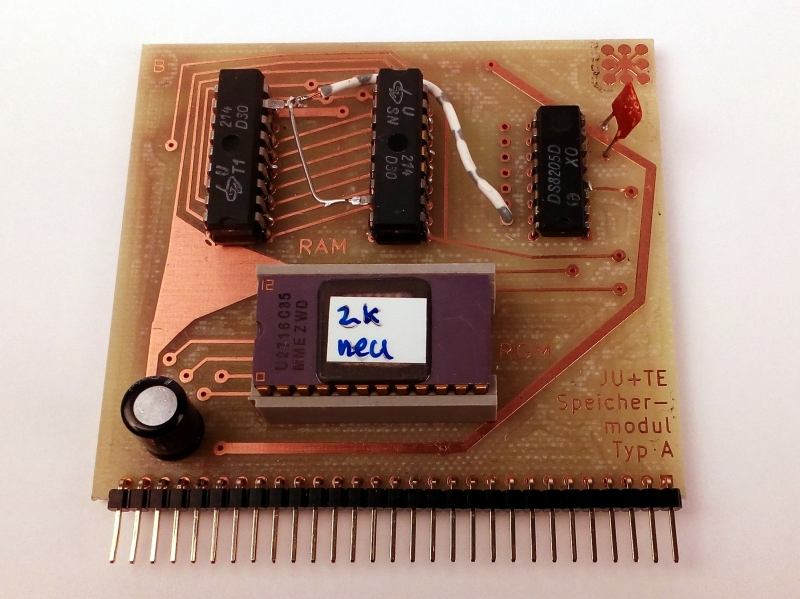
&nbsp;
  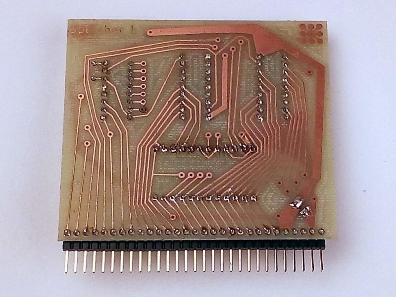

2 kByte EPROM, 1 kByte RAM (hier auf 2 kByte aufgestockt) 
Erweiterbar bis auf 8 kByte RAM durch zusätzliche U214 (Huckepack).
Für das 2k-System oder als unterer ROM für das 4k-System geeignet.

### Speichermodul Typ B

  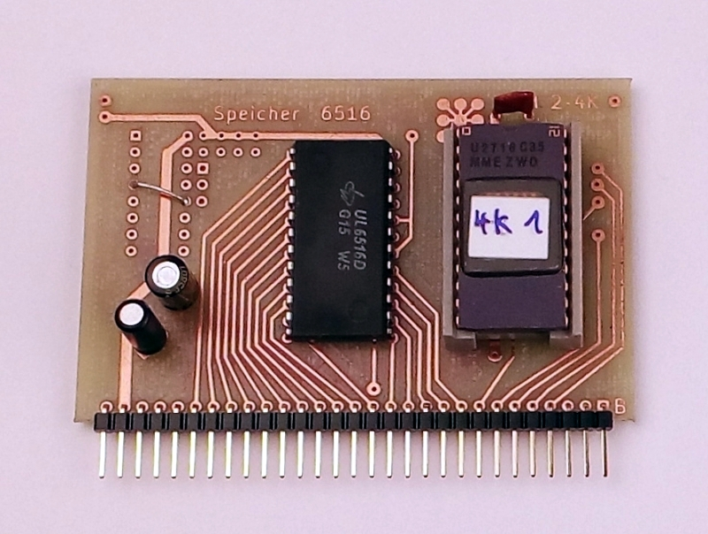
&nbsp;
  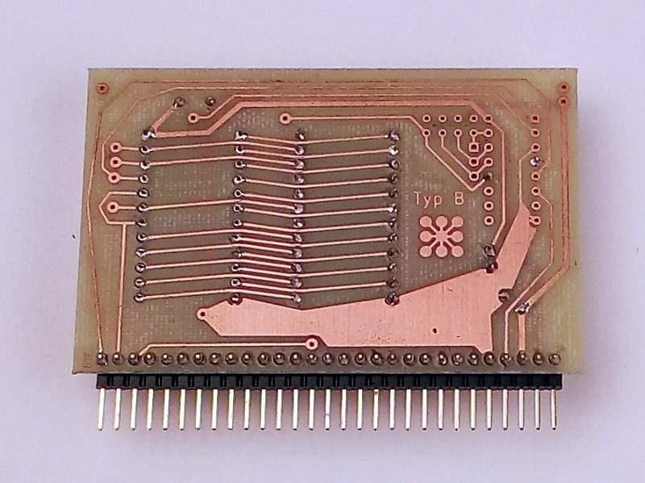

2 kByte EPROM, 2 kByte RAM 
Erweiterbar bis auf 8 kByte RAM durch zusätzliche U6516 (Huckepack).
Für das 2k-System oder als unterer ROM für das 4k-System geeignet.

### Speichermodul Typ C

  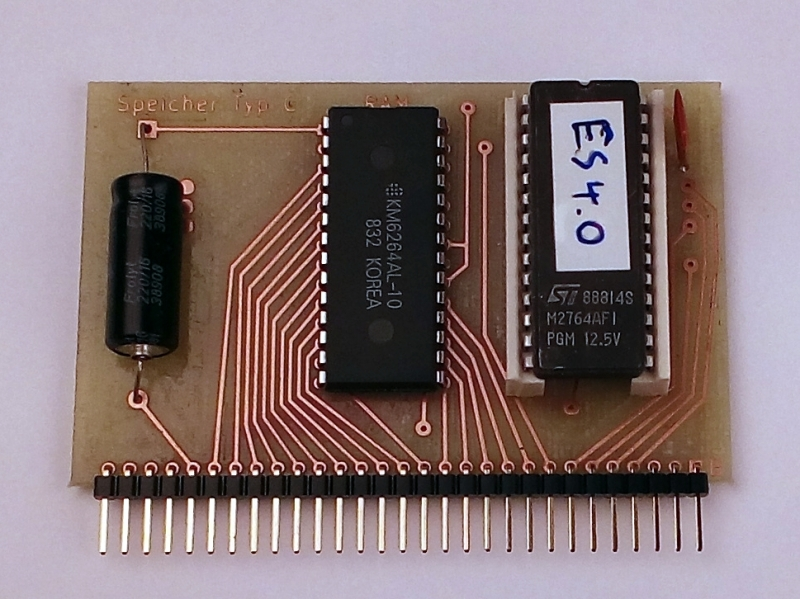
&nbsp;
  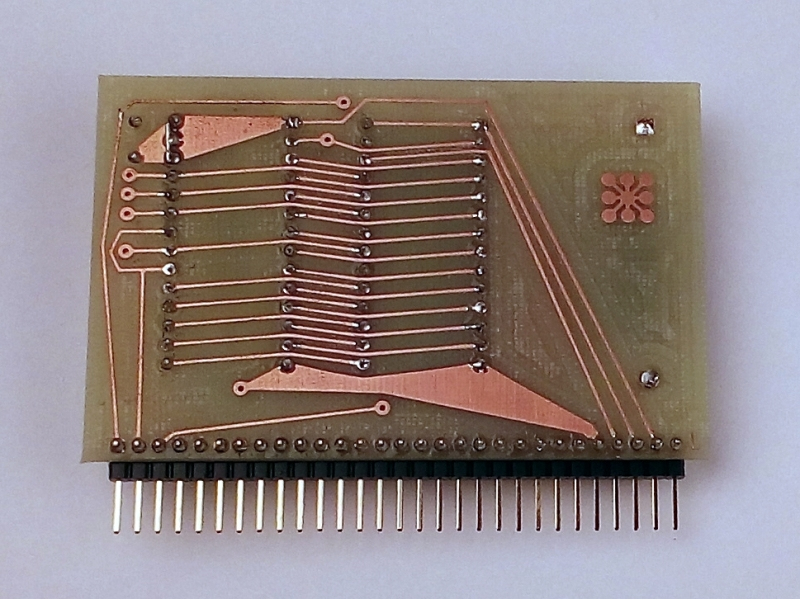

8 kByte EPROM, 8 kByte RAM 
Für alle Ausbaustufen geeignet. Wenn das 2k-System oder das 4k-System in einen U2764 (8 kByte EPROM) gebrannt werden, muss das System ab Offset 0800h stehen.
Mit vier dieser Module läßt sich ein Vollausbau des Speichers realisieren (32 kByte RAM, 30 kByte EPROM).
Auch als Videospeicher für die Videoerweiterung nutzbar. In diesem Fall wird der EPROM nicht benötigt.

### Speichermodul Typ D

  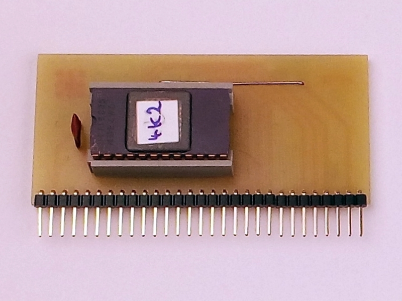
&nbsp;
  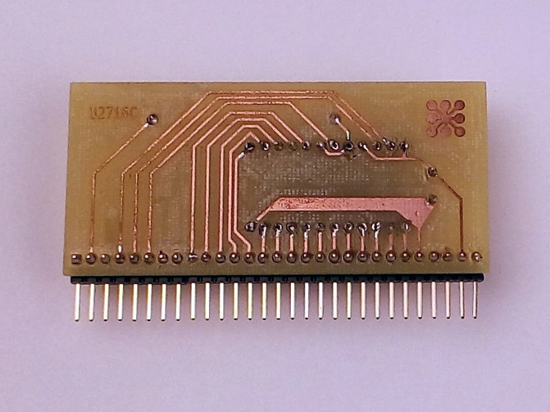

2 kByte EPROM 
Das Modul wird nur als Ergänzungsspeicher für das 4k-System benötigt, falls Modul A oder Modul B schon vorhanden sind.

### RAM-Stütze
Dient dem Erhalt des RAM-Inhaltes im ausgeschalteten Zustand für Module mit CMOS-Schaltkreisen (U224, U6516 oder HM6264LP).
Mit verbesserter Reset-Schaltung. Die Reset-Schaltung nutzt die ~9V vom Ladekondesator.

### Magnetbandanschluss

  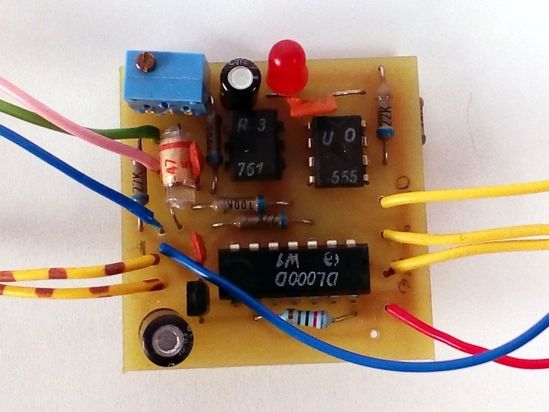
&nbsp;
  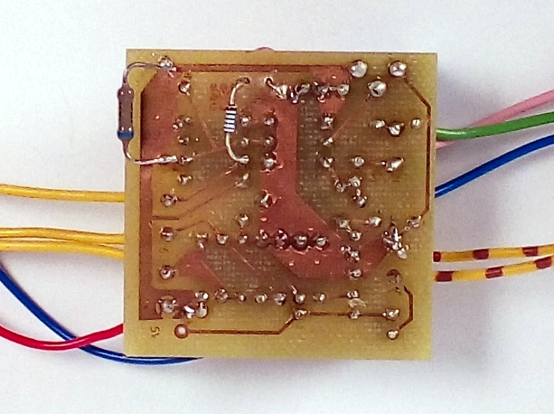

Damit lassen sich Programme auf Band sichern und wieder zurücklesen.
Das Verfahren ist relativ einfach: Die Binärdaten werden über die SIO (Port P3.7) ausgegeben und mit 4,8 kHz vom Port P3.6 moduliert.
Es wird direkt der Speicherinhalt ausgegeben. Es gibt keine Fehlererkennung bzw. -korrektur, kein Dateiname und keine Adressinformation.
Die Schaltung läßt sich optimieren, indem der Pull-Up-Widerstand zwischen OPV (B761) und Inverter (B555) auf z.B. 8 kOhm reduziert wird.
Damit wird das Puls-/Pausverhältnis korrigiert.
Mit anderen Varianten des Magnektbankinterfaces (4k-System, 6k-System) läßt sich am 2k-System nichts mehr abspeichern, da dort der Modulator (DL000) fehlt.

### Magnetbandinterface 4k-System

  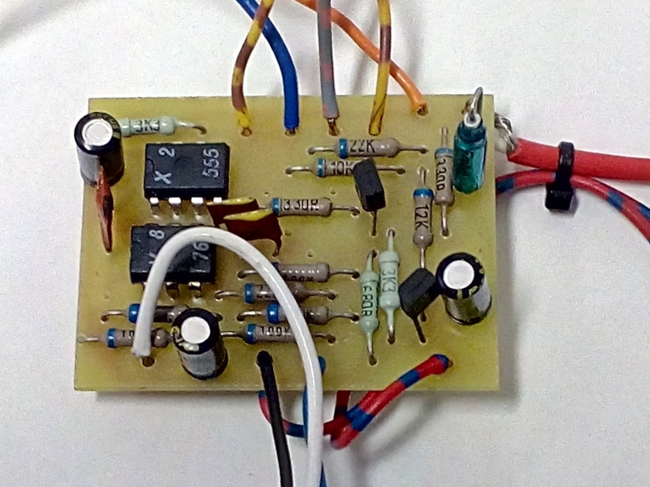
&nbsp;
  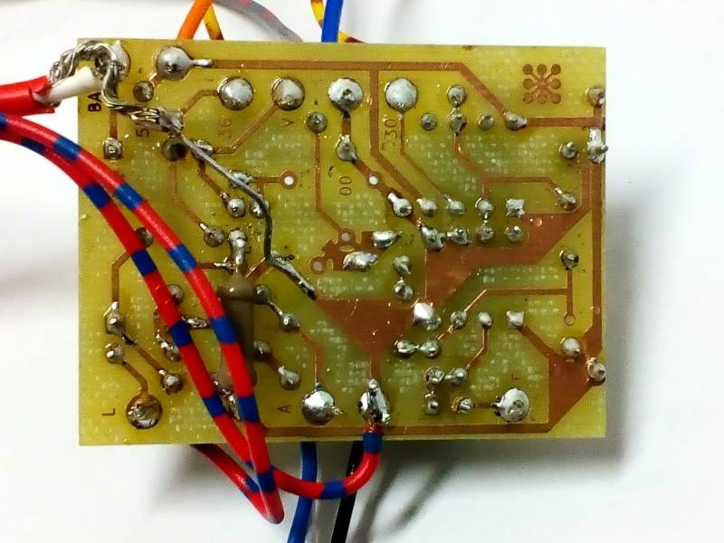

Angepasstes Magnetband-Interface für das 4k-System, mit integrierten Videosignalinverter.
Im 4k-System wird ein anderes Aufzeichnungsformat verwendet: Es gibt Trennzeichen (600 Hz), 0-Bits (1200 Hz) und 1-Bits (2400 Hz). Das Format entsprich dem des KC85 und enthält Dateinamen, Ladeadresse und Prüfsummen.

### Tastatur
Schaltungsvorschlag für eine 4x12 Matrixtastatur.

### Videoinverter
Ändert die Polarität des Videosignals und erzeugt ein BAS-Signal.
Die Originalschaltung ist sehr empfindlich. Robuster ist die Variante, die auf dem 4k-Magnetbandinterface realisiert ist. 

### UHF-Modulator
Mischt das BAS-Signal auf TV-Kanal 36. Die Erweiterung wird hier nicht weiter beschrieben.

### EPROM-Programmierzusatz
Erweiterung des JU+TE zum EPROM-Programmiergerät für die Typen U2716, U2764 und U27128.

### S3004-Interface
Potentialgetrennte Schnittstelle für die elektronische Schreibmaschine Erika S3004.
Nutzung der Schreibmaschine als Drucker.
Da der Rückkanal nicht verwendet wird, kann die Schreimaschine nicht als Tastatur genutzt werden.

### V.24-Interface
Pegelwandlerstufe zur Kopplung mit seriellen Perioheriegeräten (z.B. Drucker) oder zur Rechnerkopplung.
Die Interfaceschaltung nutzt die 9V-Spannung vom Ladekondensator.

### IFSS-Interface
Schnittstelle nach dem Prinzip der gekoppelten Stromschleifen, IFSS (Interface seriell sternförmig).
Das IFSS-Interface benötigt die 9V-Spannung vom Ladekondensator.

### AD-Wandler
Zur Messung von Spannungen zwischen 0 und 999 mV.

### Videoerweiterung
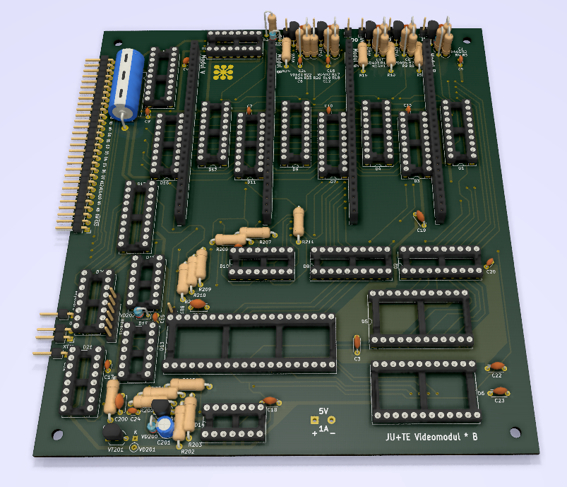
Damit wird die Videosignalerzeugung von einem separaten Prozessor (UB8810, UB8830 oder UB8860) übernommen.
Der Bildspicher wird im Bereich zwischen %4000 und %5FFF im System eingeblendet.
Über Steuerregister (Adressen %6000-%63FF) wird festgelegt, auf welche Speicherebenen des Videospeicher zugegriffen wird.

Die mögliche Bildschirmauflösung und die nutzbare Farbtiefe hängt vom Speicherausbau ab:

Speichermodule | Video-RAM | Auflösung | Farbtiefe
-------------- | --------: | :-------: | ---------
1              | 8 kByte   |  320x192  | s/w
2              | 16 kByte  |  640x192  | s/w
4              | 32 kByte  |  320x192  | 16 Farben   
4              | 32 kByte  |  640x192  | 8 Farben

Ob es Software gibt, welche die hochauflösenden 640x192 Pixel-Modi nutzt, entzieht sich meiner Kenntniss.
Die Installation der Videoerweiterung erfordert die Verdrahtung zusätzlicher Signale, die nicht am Modulsteckplatz anliegen: TAKT, /CS3, KEY und BUSY

## JU+TE Kompakt (6k-System)
Im JU+TE Kompakt sind die Videoerweiterung, das Magnetbandinterface (4k-Version), 32 kByte RAM, die RAM-Stütze und 8 kByte EPROM integriert.
Um die Videoerweiterung zu nutzen wird im EPROM das 6k-System eingespielt.

## Nutzung der frei verfügbaren Ports

| Ports                               | P2.0 | P2.1 | P2.2 | P2.3 | P2.4 | P2.5 | P2.6 | P2.7 | P3.0 | P3.1 | P3.2 | P3.3 | P3.4 | P3.5 | P3.6 | P3.7     |
| ----------------------------------- |:----:|:----:|:----:|:----:|:----:|:----:|:----:|:----:|:----:|:----:|:----:|:----:|:----:|:----:|:----:|:--------:|
| JU+TE-Grundplatine (7/1987)         |      |      |      |      |      |      |      |      |      |      |      |      | (BS) |      |      | SYN      |
| Streifenkorrektur (11/1989)         |      |      |      |      |      |      |      |      |      |      |      |      |      | VSYN |      |          |
| Magnetbandinterface (2k, 12/1987)   |      |      |      |      |      |      |      |      | LOAD |      |      |      |      |      | SAVE | Umschalt |
| Magnetbankinterface (4k, ES4.0)     |      |      |      |      |      |      |      |      | LOAD |      |      |      |      |      | SAVE |          |
| Videoerweiterung (6/1990)           |      |      |      |      |      |      |      |      |      |      | BUSY |      | /HR  |      |      |          |
| IFSS-Inferface (10/1989)            |      |      |      |      |      |      |      |      | E    |      |      |      |      |      |      | S        |
| V.24-Interface (HW-SIO, 10/1989)    |      |      |      |      |      |      |      |      | RxD  |      |      |      |      |      |      | TxD      |
| S3004-Interface (HW-SIO, 5/1989)    |      |      |      |      |      |      |      |      |      |      |      |      |      |      |      | TxD      |
| V.24-Interface (SW, K6340, 10/1989) |      |      |      |      |      |      |      |      |      | DSR  |      |      |      | TxD  |      |          |
| S3004-Interface (SW, 5/1989)        |      |      |      |      |      |      |      |      |      | DSR  |      |      |      | TxD  |      |          |
| EPROM-Programmierzusatz (10/1988)   | A+D  | A+D  | A+D  | A+D  | A+D  | A+D  | A+D  | A+D  |      |      |      |      | CTRL | CTRL | CTRL |          |
| AD-Wandler (12/1989)                | QA   | QB   | QC   | QD   | NSD  | MSD  | ISD  |      |      |      |      |      |      |      |      |          |
| Lauflicht (4(1988)                  | LED  | LED  | LED  | LED  | LED  | LED  | LED  | LED  |      |      |      |      |      |      |      |          |
| ROM-Bank (ES4.0 und 6k)             |      |      |      |      |      |      |      |      |      |      |      |      |      | /BR  |      | STEP     |
| ROM-Bank (ES1988)                   |      |      |      |      |      |      |      |      |      |      |      |      |      | STEP |      |          |
|                                     |      |      |      |      |      |      |      |      |      |      |      |      |      |      |      |          |

Legende:  
A+D = Adresse und Daten  
BR = bank reset, Bank zurücksetzen  
BS = bank switch, Bankumschaltung, bisher keine Nutzung bekannt  
BUSY = Zugriff ohne Bildstörung  
CTRL = Steuerleitung  
DSR = Dataset Read, Empfangsbereitschaft  
E = Empfang  
HR = high resolution, Umschaltung Grafikmodus  
RxD = Empfangsdaten  
S = Senden  
STEP = Bank weiterschalten  
SYN = Synchronsignal für Video  
TxD = Sendedaten  
VSYN = Zeilensynchronisierung  

## Quellen  
https://hc-ddr.hucki.net/wiki/lib/exe/fetch.php/tiny/jutecomp1.pdf  
https://hc-ddr.hucki.net/wiki/lib/exe/fetch.php/tiny/jutecomp2.pdf  
https://hc-ddr.hucki.net/wiki/lib/exe/fetch.php/tiny/jutecomp3.pdf  
