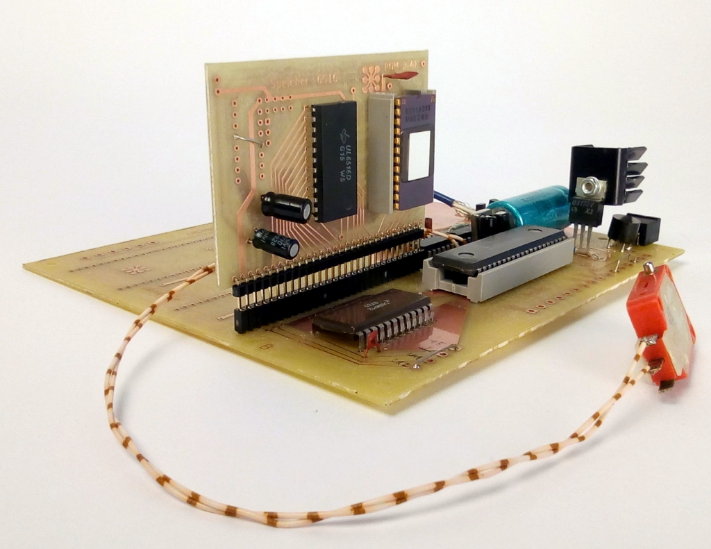

# JU+TE-Computer
Schaltpläne und Layouts (teilweise) für den JU+TE Computer

## JU+TE Tiny (2k-System)
Da vom JU+TE Computer kein zusammenhängender Schaltplan existierte, wurde er mit KiCAD erstellt.
Dieser Schaltplan wurde mit dem existierenden Layout verknüpft.
Schaltplan und Layout sind konsistent.

Für den Minimalbetrieb sind ein Speichermodul (Typ A, B oder C) und eine Tastatur erforderlich.

## Erweiterungen zum JU+TE

### Speichermodul A
2 kByte EPROM, 1 kByte RAM
Erweiterbar bis auf 8 kByte RAM durch zusätzliche U214 (Huckepack).

### Speichermodul B
2 kByte EPROM, 2 kByte RAM
Erweiterbar bis auf 8 kByte RAM durch zusätzliche U6516 (Huckepack).

### Speichermodul C
8 kByte EPROM, 8 kByte RAM
Mit vier dieser Module läßt sich ein Vollausbau des Speichers realisieren (32 kByte RAM, 30 kByte EPROM).

### Speichermodul D
2 kByte EPROM
Zusammen mit Modul A oder Modul B wird damit die Voraussetzung für 4k-System geschaffen.

### RAM-Stütze
Dient dem Erhalt des RAM-Inhaltes im ausgeschalteten Zustand für Module mit CMOS-Schaltkreisen (U224, U6516 oder HM6264LP).
Mit verbesserter Reset-Schaltung. Die Reset-Schaltung nutzt die ~9V vom Ladekondesator.

### Magnetbandanschluss
Damit lassen sich Programme auf Band sichern und wieder zurücklesen.
Bekannte Schwachstelle: Die Magnetbandschnittstelle sollte nicht verwendet werden, da sie sehr störungsanfällig ist.
Im Sonderdruck ES4.0 gibt es eine überarbeitete Version.

### Magnetbandinterface 4k-System
Modifiziertes und verbessertes Magnetband-Interface für das 4k-System, mit integrierten Videosignalinverter.

### Tastatur
Schaltungsvorschlag für eine 4x12 Matrixtastatur.

### Videoinverter
Ändert die Polarität des Videosignals und erzeugt ein BAS-Signal.
Die Originalschaltung ist sehr empfindlich. Robuster ist die Variante, die auf dem 4k-Magnetbandinterface realisiert ist. 

### UHF-Modulator
Mischt das BAS-Signal auf TV-Kanal 36. Die Erweiterung wird hier nicht weiter beschrieben.

### EPROM-Programmierzusatz
Erweiterung des JU+TE zum EPROM-Programmiergerät für die Typen U2716, U2764 und U27128.

### S3004-Interface
Potentialgetrennte Schnittstelle für die elektronische Schreibmaschine Erika S3004.
Nutzung der Schreibmaschine als Drucker.
Da der Rückkanal nicht verwendet wird, kann die Schreimaschine nicht als Tastatur genutzt werden.

### V.24-Interface
Pegelwandlerstufe zur Kopplung mit seriellen Perioheriegeräten (z.B. Drucker) oder zur Rechnerkopplung.
Die Interfaceschaltung nutzt die ~9V vom Ladekondesator.

### IFSS-Interface
Schnittstelle nach dem Prinzip der gekoppelten Stromschleifen, IFSS (Interface seriell sternförmig).

### AD-Wandler
Zur Messung von Spannungen zwischen 0 und 999 mV.

### Videoerweiterung
Damit wird die Videosignalerzeugung von einem separaten Prozessor (UB8810) übernommen.
Der Bildspicher wird im Bereich zwischen %4000 uns %5FFF im System eingeblendet.
Über ein Steuerregister (Adresse %6000) wird festgelegt, auf welche Speicherebenen des Videospeicher zugegriffen wird.

Die mögliche Bildschirmauflösung und die nutzbare Farbtiefe hängt vom Speicherausbau ab:

Speichermodule | Video-RAM | Auflösung | Farbtiefe
-------------- | --------: | :-------: | ---------
1              | 8 kByte   |  320x192  | s/w
2              | 16 kByte  |  640x192  | s/w
4              | 32 kByte  |  320x192  | 16 Farben   
4              | 32 kByte  |  640x192  | 8 Farben

Ob es Software gibt, welche die 640x192 Pixel-Modi nutzt, entzieht sich meiner Kenntniss.
Die Installation der Videoerweiterung erfordert die Verdrahtung zusätzlicher Signale, die nicht am Modulsteckplatz anliegen: TAKT, /CS3, KEY und BUSY

### Speichermodul VRAM
8 kByte RAM
Speichermodul für die Videoerweiterung. Modul ohne EPROM-Speicher.

## JU+TE Kompakt (6k-System)
Im JU+TE Kompakt sind die Videoerweiterung, das Magnetbandinterface (4k-Version), 32 kByte RAM, die RAM-Stütze und 8 kByte EPROM integriert.
Um die Videoerweiterung zu nutzen wird im EPROM das 6k-System eingespielt.

## Quellen  
https://hc-ddr.hucki.net/wiki/lib/exe/fetch.php/tiny/jutecomp1.pdf  
https://hc-ddr.hucki.net/wiki/lib/exe/fetch.php/tiny/jutecomp2.pdf  
https://hc-ddr.hucki.net/wiki/lib/exe/fetch.php/tiny/jutecomp3.pdf  
